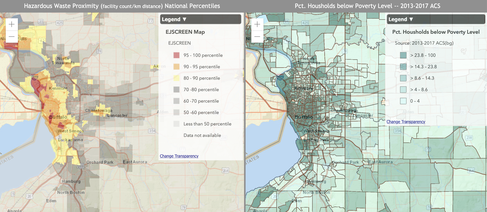
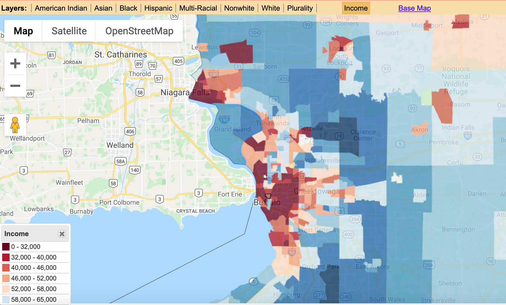
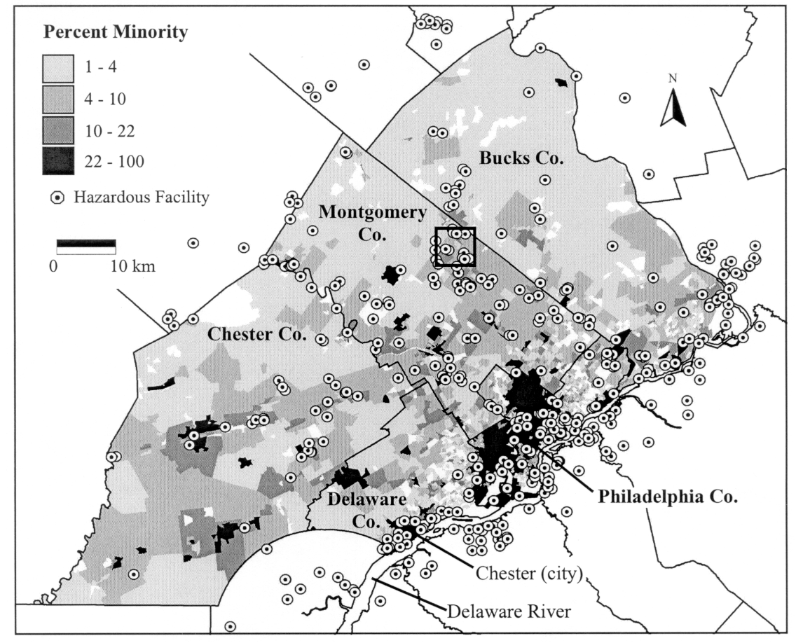

Final Project Proposal
================
Sandra Notaro

# Introduction to problem/question

I want to create directions that upperclassmen college students can
follow as a lab. This lab will consist of them following code to display
two maps of Western New York. One map will display DEC remediation sites
(sites that are contaminated and in the process of being remdiated or
have been remediated) and the other map will display income. I may also
add a map displaying race. These maps will be used to teach the students
about environmental injustice and how to analyze the maps.

# Problem / Question

How can I effectively create directions that college students can follow
to make environmental justice maps similar to what they can observe on
EJSCREEN?

# Inspiring Examples

## Example 1



I used EJSCREEN for an essay I had in my environmental sociology class.
EJSCREEN is super easy to use and great for the general public to be
introduced to analyzing maps. However, since EJSCREEN is so user
friendly, it takes a very short amount of time to create maps and would
not suffice for a 3 hour lab. The maps that can be created in EJSCREEN
are a good basis for what I would like the students to create in
RStudio.

## Example 2



In my research, I found this map that allows you to choose different
layers to display different aspects of environmental injustice issues at
the census tract level. I have chosen to use census tract data to gather
income and race data. It is difficult choosing the level of geography
(county, census tract, zip code, etc.) to map by since it is not well
agreed upon for which the best level is to analyze maps. For the sake of
students understanding the map, using census tracts makes the most
sense.

## Example 3



Plotting location of hazardous facilities will help the students easily
observe where the source of contamination is coming from. I do not plan
for the students to map the hazardous facilities layered on top of the
income and race layers since I think this looks too messy, but this
image provides a basic example of what message I want the students to
grasp.

# Proposed data sources

The DEC provides a dataset of their remdiation sites that is easily
exported to a csv from this source
<https://data.ny.gov/Energy-Environment/Environmental-Remediation-Sites/c6ci-rzpg>.
The DEC is well known among environmental-based college students and
will familiarize them with the data the DEC collects. A point map will
be made from this data set.

There is a package called `tidycensus` that has simple feature geometry
for geographic units (including census tracts) with variables from the
decennial US Census and American Community survey. I chose the American
Community survey since I can gather more recent data. This package
allows you to choose one-year, three-year, and five-year surveys
expressed as `"acs1"`, `"acs3"`, and `"acs5"`. According to
<https://www.census.gov/programs-surveys/acs/guidance/estimates.html>,
using the 5-year survey is best for examining census tract data. As a
result, I will be using “acs5” dataset.

# Proposed methods

I plan to have the students use leaflet so they can pan around the map
to explore their findings. With leaflet, `addCircleMarkers()` can be
used to plot the locations of the hazardous facilities. Using the popup
argument in `addCirlceMarkers()` could be useful to provide specific
data to the students for information on income data per census tract.
`addProviderTiles()` will be used to add a basemap, but I will need to
explore more which provider tile will be the best option. I am still not
sure if I want to set boundaries for the map with `setMaxBounds()`. It
will allow the students to focus their attention to Western New York,
but I’m not sure if restricting them is necessary. There are many more
functions and arguments I can use for leaflet, but these are the base
ones necessary to start the maps.

`tidycensus` makes it very easy to sort through data. By using

``` r
library(tidycensus)
library(tidyverse)

testacs <- load_variables(2018, "acs5", cache = TRUE)
view(testacs)
```

I was able to filter through the data to see what labels I wanted to
use. There are many different label options for income. A couple I found
useful to map were estimate of median nonfamily household income in the
past 12 months and estimate of total household income in the past 12
months with less than $10,000. I am pretty sure the second label I
mentioned is saying if the household made less than $10,000, but I will
need to observe the data to confirm this (the end of the label just says
“Less than $10,000”). Race had much less label options, but a couple I
found useful were total black population and total population of two or
more races. I need to observe the data to confirm if population of two
of more races simply accounts for two or more races, or if the
individual people are two or more races.

Since I will be using this project as a lab for college students, I am
debating whether or not I should include the steps the students will
read within this script. This may be distracting to the project, so I
will need to think about this more.

# Expected results

I want the students to create two, maybe three maps. These maps may end
up being side-by-side. One map will have display income and the other
map will show locations of hazardous facilities. The possible third map
will display race. The students can then analyze what environental
injustice issues are occurring from these maps. This is overall a
teaching moment for the students to visualize and understand
environmental injustice.
