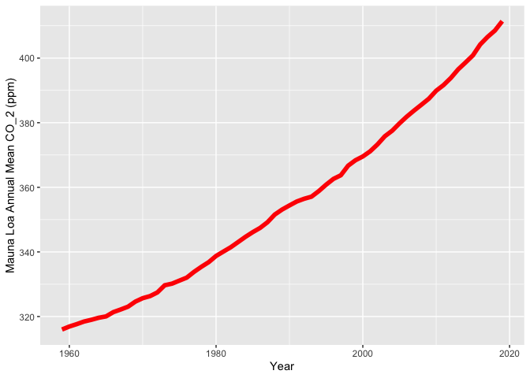

Carbon Dioxide Concentrations at Mona Loa Observatory
================
Sandra Notaro
10/26/2020

# Annual Mean Carbon Dioxide Concentrations 1959-Present

<!-- -->

# Top Five Annual Mean Carbon Dioxide Concentrations at Mona Loa

| year |   mean |
| ---: | -----: |
| 2019 | 411.43 |
| 2018 | 408.52 |
| 2017 | 406.55 |
| 2016 | 404.22 |
| 2015 | 400.83 |

## Tina and Betsy helped me make my table look properly by combining different ideas
