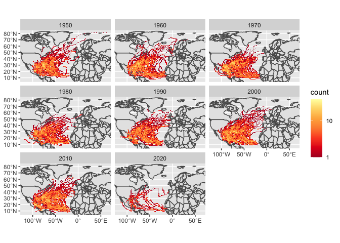

Case Study 09
================
Sandra Notaro
November 1, 2020

# Preparing the data

``` r
dataurl="https://www.ncei.noaa.gov/data/international-best-track-archive-for-climate-stewardship-ibtracs/v04r00/access/shapefile/IBTrACS.NA.list.v04r00.points.zip"
tdir=tempdir()
download.file(dataurl,destfile=file.path(tdir,"temp.zip"))
unzip(file.path(tdir,"temp.zip"),exdir = tdir)
#list.files(tdir)
storm_data <- read_sf(list.files(tdir,pattern=".shp",full.names = T))
```

# Filtering for years 1950s to present and identifying the bounding box of the storm data

``` r
filtered_1950_present <- storm_data %>%
  filter(SEASON >= 1950) %>%
  mutate_if(is.numeric, function(x) ifelse(x==-999.0,NA,x)) %>%
  mutate(decade=(floor(year/10)*10))
region <- st_bbox(filtered_1950_present)
```

# Plotting maps

<!-- -->

# Reprojecting `us_states` to the reference system of `filtered_1950_present` and renaming `NAME` column to `state`

``` r
state <- us_states %>%
  st_transform(crs = st_crs(filtered_1950_present)) %>%
  select(state = NAME)
```

# Spatial join between storm database and `state` object

``` r
storm_states <- st_join(filtered_1950_present, state, join = st_intersects,left = F)
```

# Making the table

    `summarise()` ungrouping output (override with `.groups` argument)

| state          | filtered\_1950\_present |
| :------------- | ----------------------: |
| Florida        |                      82 |
| North Carolina |                      62 |
| Georgia        |                      57 |
| Texas          |                      53 |
| Louisiana      |                      49 |

Learned how to get rid of geometry column from
<https://r-spatial.github.io/sf/reference/st_geometry.html>
