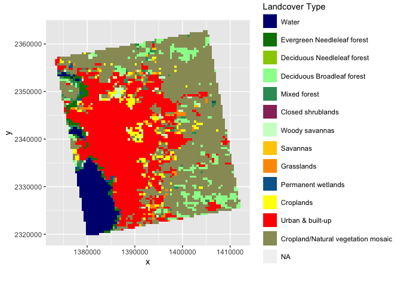

Case Study 10
================
Sandra Notaro
November 6, 2020

# Preparing the Data

``` r
dir.create("data",showWarnings = F)

lulc_url="https://github.com/adammwilson/DataScienceData/blob/master/inst/extdata/appeears/MCD12Q1.051_aid0001.nc?raw=true"
lst_url="https://github.com/adammwilson/DataScienceData/blob/master/inst/extdata/appeears/MOD11A2.006_aid0001.nc?raw=true"

download.file(lulc_url,destfile="data/MCD12Q1.051_aid0001.nc", mode="wb")
download.file(lst_url,destfile="data/MOD11A2.006_aid0001.nc", mode="wb")
```

# Loading the data into R

``` r
lulc = stack("data/MCD12Q1.051_aid0001.nc",varname="Land_Cover_Type_1")
```

    ## [1] ">>>> WARNING <<<  attribute latitude_of_projection_origin is an 8-byte value, but R"
    ## [1] "does not support this data type. I am returning a double precision"
    ## [1] "floating point, but you must be aware that this could lose precision!"
    ## [1] ">>>> WARNING <<<  attribute longitude_of_central_meridian is an 8-byte value, but R"
    ## [1] "does not support this data type. I am returning a double precision"
    ## [1] "floating point, but you must be aware that this could lose precision!"
    ## [1] ">>>> WARNING <<<  attribute longitude_of_projection_origin is an 8-byte value, but R"
    ## [1] "does not support this data type. I am returning a double precision"
    ## [1] "floating point, but you must be aware that this could lose precision!"
    ## [1] ">>>> WARNING <<<  attribute straight_vertical_longitude_from_pole is an 8-byte value, but R"
    ## [1] "does not support this data type. I am returning a double precision"
    ## [1] "floating point, but you must be aware that this could lose precision!"
    ## [1] ">>>> WARNING <<<  attribute false_easting is an 8-byte value, but R"
    ## [1] "does not support this data type. I am returning a double precision"
    ## [1] "floating point, but you must be aware that this could lose precision!"
    ## [1] ">>>> WARNING <<<  attribute false_northing is an 8-byte value, but R"
    ## [1] "does not support this data type. I am returning a double precision"
    ## [1] "floating point, but you must be aware that this could lose precision!"

``` r
lst = stack("data/MOD11A2.006_aid0001.nc",varname="LST_Day_1km")
```

    ## [1] ">>>> WARNING <<<  attribute latitude_of_projection_origin is an 8-byte value, but R"
    ## [1] "does not support this data type. I am returning a double precision"
    ## [1] "floating point, but you must be aware that this could lose precision!"
    ## [1] ">>>> WARNING <<<  attribute longitude_of_central_meridian is an 8-byte value, but R"
    ## [1] "does not support this data type. I am returning a double precision"
    ## [1] "floating point, but you must be aware that this could lose precision!"
    ## [1] ">>>> WARNING <<<  attribute longitude_of_projection_origin is an 8-byte value, but R"
    ## [1] "does not support this data type. I am returning a double precision"
    ## [1] "floating point, but you must be aware that this could lose precision!"
    ## [1] ">>>> WARNING <<<  attribute straight_vertical_longitude_from_pole is an 8-byte value, but R"
    ## [1] "does not support this data type. I am returning a double precision"
    ## [1] "floating point, but you must be aware that this could lose precision!"
    ## [1] ">>>> WARNING <<<  attribute false_easting is an 8-byte value, but R"
    ## [1] "does not support this data type. I am returning a double precision"
    ## [1] "floating point, but you must be aware that this could lose precision!"
    ## [1] ">>>> WARNING <<<  attribute false_northing is an 8-byte value, but R"
    ## [1] "does not support this data type. I am returning a double precision"
    ## [1] "floating point, but you must be aware that this could lose precision!"

# Plotting All of the Land Use Land Cover Data

``` r
plot(lulc)
```

<!-- -->

# Plotting the Land Use Land Cover 2013 Data

``` r
lulc = lulc[[13]]
plot(lulc)
```

<!-- -->

# Processing the Land Cover Data

``` r
Land_Cover_Type_1 = c(
  Water = 0, 
  `Evergreen Needleleaf forest` = 1, 
  `Evergreen Broadleaf forest` = 2,
  `Deciduous Needleleaf forest` = 3, 
  `Deciduous Broadleaf forest` = 4,
  `Mixed forest` = 5, 
  `Closed shrublands` = 6,
  `Open shrublands` = 7,
  `Woody savannas` = 8, 
  Savannas = 9,
  Grasslands = 10,
  `Permanent wetlands` = 11, 
  Croplands = 12,
  `Urban & built-up` = 13,
  `Cropland/Natural vegetation mosaic` = 14, 
  `Snow & ice` = 15,
  `Barren/Sparsely vegetated` = 16, 
  Unclassified = 254,
  NoDataFill = 255)

lcd=data.frame(
  ID=Land_Cover_Type_1,
  landcover=names(Land_Cover_Type_1),
  col=c("#000080","#008000","#00FF00", "#99CC00","#99FF99", "#339966", "#993366", "#FFCC99", "#CCFFCC", "#FFCC00", "#FF9900", "#006699", "#FFFF00", "#FF0000", "#999966", "#FFFFFF", "#808080", "#000000", "#000000"),
  stringsAsFactors = F)
```

``` r
kable(head(lcd))
```

|                             | ID | landcover                   | col      |
| :-------------------------- | -: | :-------------------------- | :------- |
| Water                       |  0 | Water                       | \#000080 |
| Evergreen Needleleaf forest |  1 | Evergreen Needleleaf forest | \#008000 |
| Evergreen Broadleaf forest  |  2 | Evergreen Broadleaf forest  | \#00FF00 |
| Deciduous Needleleaf forest |  3 | Deciduous Needleleaf forest | \#99CC00 |
| Deciduous Broadleaf forest  |  4 | Deciduous Broadleaf forest  | \#99FF99 |
| Mixed forest                |  5 | Mixed forest                | \#339966 |

# Converting the Land Use Land Cover Raster into a Categorical Raster

``` r
lulc = as.factor(lulc)

levels(lulc) = left_join(levels(lulc)[[1]],lcd)
```

# Plotting the Converted Raster

``` r
gplot(lulc)+
  geom_raster(aes(fill = as.factor(value)))+
  scale_fill_manual(values=levels(lulc)[[1]]$col,
                    labels=levels(lulc)[[1]]$landcover,
                    name="Landcover Type")+
  coord_equal()+
  theme(legend.position = "right")+
  guides(fill = guide_legend(ncol=1, byrow=TRUE))
```

<!-- -->

# Observing Land Surface Temperature

``` r
plot(lst[[1:12]])
```

<!-- -->

# Converting Land Surface Temperature from Kelvin to Celcius

``` r
offs(lst) = -273.15
plot(lst[[1:10]])
```

<!-- -->

# Adding Dates to Time (z) Dimension

``` r
names(lst)[1:5]
```

    ## [1] "X2000.02.18" "X2000.02.26" "X2000.03.05" "X2000.03.13" "X2000.03.21"

``` r
tdates = names(lst)%>%
  sub(pattern = "X", replacement = "")%>%
  as.Date("%Y.%m.%d")

names(lst) = 1:nlayers(lst)
lst = setZ(lst,tdates)
```

# Extracting Timeseries for a Point

## Defining a new spatial point at that location

``` r
lw = SpatialPoints(data.frame(x = -78.791547, y = 43.007211))
```

## Setting the projection

``` r
projection(lw) <- "+proj=longlat"
lw_transf <- spTransform(lw, "+proj=longlat")
```

## Extracting and Transposing the Land Surface Temperature Data

``` r
extract_lst <- raster::extract(lst, lw, buffer = 1000, fun = mean, na.rm=T)
transpose_lst <- t(extract_lst)
```

## Extracting the Dates and Combining Them Into a Data Frame with Extracted LST Data

``` r
extract_dates <- getZ(lst)
combined_df <- bind_cols(transpose_lst, extract_dates)
```

## Plotting Land Surface Temperature

``` r
renamed_df <- combined_df %>%
  rename(date = ...2, temp = ...1)
lst_final_plot <- ggplot(renamed_df, aes(date, temp)) + geom_point() + 
  geom_smooth(span = 0.05, n = 250, se = FALSE) + 
  labs(x = "Date", y = "Monthly Mean Land Surface Temperature") + 
  theme(axis.title = element_text(size = 10))
```

    ## `geom_smooth()` using method = 'loess' and formula 'y ~ x'

    ## Warning: Removed 82 rows containing non-finite values (stat_smooth).

    ## Warning: Removed 82 rows containing missing values (geom_point).

<!-- -->

### Learned how to use span and n from <https://ggplot2.tidyverse.org/reference/geom_smooth.html>

# Summarizing Weekly Data to Monthly Climatologies

``` r
tmonth <- as.numeric(format(getZ(lst),"%m"))
```

## Summarizing the Mean Value

``` r
lst_month <- stackApply(lst, tmonth, fun = mean)
```

### Tina helped with the stackApply() step

## Setting Names of the Layers to Months

``` r
names(lst_month) = month.name
```

## Plotting the Map for Each Month

``` r
month_plot <- gplot(lst_month) + geom_raster(aes(fill = value)) + facet_wrap(~variable) +
  scale_fill_gradient2(low = "red", mid = "white", 
                       high = "blue", midpoint = 15) + coord_equal() + 
  theme(axis.text = element_blank())
```

<!-- -->

### Tina sent me <https://ggplot2.tidyverse.org/reference/scale_gradient.html> to know how to color the facets

## Finding Monthly Mean

``` r
monthly_mean <- cellStats(lst_month, mean)
```

``` r
knitr::kable(monthly_mean, "simple")
```

|           |          x |
| --------- | ---------: |
| January   | \-2.127506 |
| February  |   8.710271 |
| March     |  18.172077 |
| April     |  23.173591 |
| May       |  26.990005 |
| June      |  28.840144 |
| July      |  27.358260 |
| August    |  22.927727 |
| September |  15.477510 |
| October   |   8.329881 |
| November  |   0.586179 |
| December  | \-4.754134 |

# Summarizing Land Surface Temperature by Land Cover

``` r
resampling <- resample(lulc, lst, method = "ngb")
```

## Extracting Values

``` r
lcds1 = cbind.data.frame(
  values(lst_month),
  ID = values(resampling[[1]])) %>%
  na.omit()
```

## Gathering the Data into a Tidy Format

``` r
gathering <- gather(lcds1, key = "month", value = "value", -ID)
```

## Converting ID to Numeric and Month to an Ordered Factor

``` r
id_month <- gathering %>%
  mutate(ID = as.numeric(ID)) %>%
  mutate(month = factor(month, levels = month.name, ordered=T))
```

## Left Join

``` r
join_lcd <- left_join(id_month, lcd)
```

## Filtering

``` r
filtered_lcd <- join_lcd %>% 
  filter(landcover %in% c("Urban & built-up","Deciduous Broadleaf forest"))
```

## Illustrating the Monthly Variability in Land Surface Temperature

``` r
variability_plot <- ggplot(filtered_lcd, aes(month, value))+ facet_wrap(~landcover) +
  geom_point(alpha=.5, position = "jitter") +
  geom_smooth() +
  geom_violin(alpha = .5, col = "red", scale = "width",position = "dodge")+
  theme(axis.text.x = element_text(angle = 90, hjust = 1))+
  ylab("Monthly Mean Land Surface Temperature (C)")+
  xlab("Month")+
  ggtitle("Land Surface Temperature in Urban and Forest areas in Buffalo, NY") + 
  theme(axis.title = element_text(size = 16), axis.text = element_text(size = 12),
        plot.title = element_text(size = 14))
```

    ## `geom_smooth()` using method = 'loess' and formula 'y ~ x'

<!-- -->
