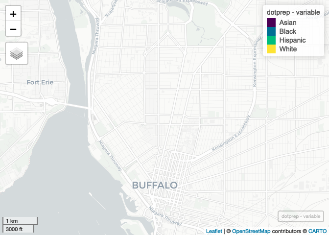

Case Study 11
================
Sandra Notar
Novemer 16, 2020

# Preparing the Data

``` r
library(tidyverse)
library(spData)
library(sf)

library(mapview)
library(foreach)
library(doParallel)
registerDoParallel(4)
getDoParWorkers()
library(tidycensus)
library(lwgeom)
```

# Getting the tidycensus Data

``` r
racevars <- c(White = "P005003", 
              Black = "P005004", 
              Asian = "P005006", 
              Hispanic = "P004003")

options(tigris_use_cache = TRUE)
erie <- get_decennial(geography = "block", variables = racevars, 
                  state = "NY", county = "Erie County", geometry = TRUE,
                  summary_var = "P001001", cache_table=T) 
```

# Creating Max Boundaries

``` r
boundaries <- c(xmin=-78.9,xmax=-78.85,ymin=42.888,ymax=42.92)
cropped <- st_crop(erie, boundaries)
```

    ## Warning: attribute variables are assumed to be spatially constant throughout all
    ## geometries

Got help from Tina how to crop

# Preparing Dot Plot

``` r
groups <- as.factor(cropped$variable)
dotprep <- foreach(i=1:4, .combine = "rbind", .packages = c("tidyverse", "sf")) %dopar% {
  races <- levels(groups)[i]
cropped %>%
    filter(variable == races) %>%
    st_sample(size = .$value) %>%
    st_as_sf() %>%
    mutate(variable = races)
}
```

Tina helped with troubleshooting errors Used
<https://www.rdocumentation.org/packages/foreach/versions/1.5.1/topics/foreach>
for help on how to use `foreach()`

# Map

``` r
dotplot <- mapview(dotprep, zcol = "variable", cex = 1, lwd = 0)
dotplot
```

<!-- -->
