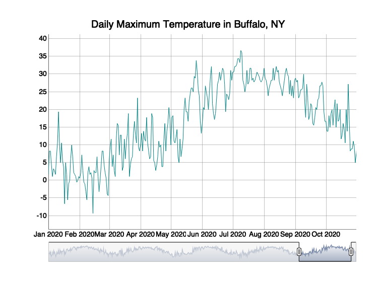

Case Study 12
================
Sandra Notaro
November 25, 2020

# Preparing the Data

``` r
library(dplyr)
library(ggplot2)
library(ggmap)
library(htmlwidgets)
library(widgetframe)
library(tidyverse)
library(rnoaa)
library(xts)
library(dygraphs)
```

# Downloading the Daily Weather Data

``` r
d <- meteo_tidy_ghcnd("USW00014733",
                   date_min = "2016-01-01", 
                   var = c("TMAX"),
                   keep_flags=T) %>% 
  mutate(date = as.Date(date), 
         tmax = as.numeric(tmax)/10)
```

# Converting d Into an `xts` Time Series

``` r
d_time_series <- xts(d$tmax, order.by = d$date)
```

# Plot

``` r
dygraph(d_time_series, main = "Daily Maximum Temperature in Buffalo, NY") %>%
  dyRangeSelector(dateWindow = c("2020-01-01", "2020-10-31"))
```

<!-- -->
